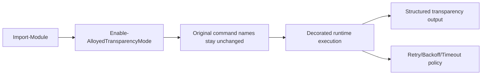
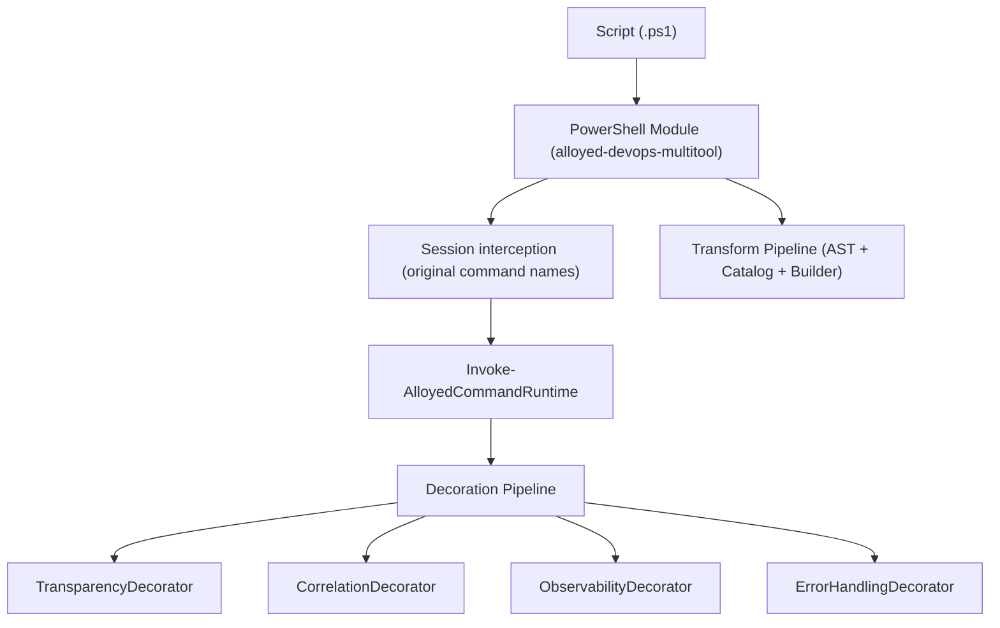
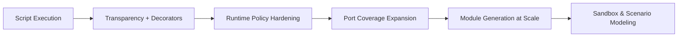

# alloyed-devops-multitool

[](https://github.com/Ligare-Method/alloyed-devops-multitool/actions/workflows/ci.yml)
[](https://github.com/Ligare-Method/alloyed-devops-multitool/actions/workflows/integration-publish.yml)
[](https://github.com/Ligare-Method/alloyed-devops-multitool/actions/workflows/ci.yml)

`alloyed-devops-multitool` is a PowerShell modernization toolkit:

- run existing scripts through decorators without renaming commands,
- transform scripts into wrapper-based modules,
- control runtime behavior with explicit configuration.

## Table of Contents

- [Why This Exists](#why-this-exists)
- [Quick Start](#quick-start)
- [Execution Flow](#execution-flow)
- [Architecture](#architecture)
- [Public Command Surface](#public-command-surface)
- [Runtime Policy](#runtime-policy)
- [Script Transformation](#script-transformation)
- [Migration Roadmap View](#migration-roadmap-view)
- [Validation](#validation)
- [Documentation](#documentation)
- [Repository Layout](#repository-layout)
- [License](#license)
- [Release Pipeline](#release-pipeline)

## Why This Exists

Many teams have production PowerShell scripts that are hard to observe, risky to refactor, and expensive to rewrite.
This module provides a low-friction migration path:

1. keep original command names,
2. add transparency/decorators,
3. evolve toward generated modules and explicit ports.

## Quick Start

Prerequisites:

- PowerShell 7+
- .NET 8 SDK

Import module:

```powershell
Import-Module ./src/powershell/Alloyed.DevOps.Multitool.psd1 -Force
```

Run a script with decorators in one command:

```powershell
Invoke-AlloyedScript -ScriptPath ./scripts/automation.ps1
```

Bootstrap current session from config (recommended for iterative local work):

```powershell
Start-AlloyedSession
# ...run scripts...
Stop-AlloyedSession
```

Manual mode (if you want full session control):

```powershell
Enable-AlloyedTransparencyMode
./scripts/automation.ps1
Disable-AlloyedTransparencyMode
```

## Execution Flow



## Architecture



## Public Command Surface

Primary runtime commands:

- `Invoke-AlloyedScript`
- `Start-AlloyedSession`
- `Stop-AlloyedSession`
- `Enable-AlloyedTransparencyMode`
- `Disable-AlloyedTransparencyMode`
- `Set-AlloyedTransparencyProfile`
- `Get-AlloyedTransparencyModeStatus`

Configuration commands:

- `Initialize-AlloyedRuntimeConfig`
- `Set-AlloyedRuntimeConfig`
- `Test-AlloyedRuntimeConfig`

Transform commands:

- `New-AlloyedModuleTransform`
- `Test-AlloyedTransform`
- `Get-AlloyedCatalog`
- `Get-AlloyedRuntimeConfiguration`

## Runtime Policy

Tune runtime behavior with environment variables:

- `ALLOYED_RUNTIME_MAX_RETRIES` (default `0`)
- `ALLOYED_RUNTIME_RETRY_DELAY_SEC` (default `2`)
- `ALLOYED_RUNTIME_EXPONENTIAL_BACKOFF` (`true|false`, default `false`)
- `ALLOYED_RUNTIME_PREVIEW` (`true|false`, default `false`)
- `ALLOYED_RUNTIME_TIMEOUT_SEC` (default `0`, disabled)
- `ALLOYED_CONSOLE_OUTPUT_MODE` (`Plain|Rich`, default `Plain`)
- `ALLOYED_TRANSPARENCY_VERBOSE` (`true|false`, default `false`)
- `ALLOYED_TRANSPARENCY_PROFILE` (`minimal|standard|debug`, default `standard`)

Recommended presets:

```powershell
# daily readable mode
Enable-AlloyedTransparencyMode -Profile standard -Quiet

# deep troubleshooting mode
Enable-AlloyedTransparencyMode -Profile debug
```

Timeout behavior:

- hard timeout is applied for non-pipeline wrapper calls,
- pipeline-input calls use safe fallback without hard cancellation.

## Script Transformation

Transform a script into a generated module:

```powershell
New-AlloyedModuleTransform `
  -ScriptPath ./samples/sample-transform-input.ps1 `
  -ModuleName DemoAlloyed `
  -OutputPath ./temp/out `
  -Force
```

Validate transform only:

```powershell
Test-AlloyedTransform -ScriptPath ./samples/sample-transform-input.ps1
```

## Migration Roadmap View



## Validation

Run local CI-equivalent:

```powershell
pwsh -NoProfile -File ./dev.ps1 -Stage ci
```

Targeted stages:

```powershell
pwsh -NoProfile -File ./dev.ps1 -Stage unit
pwsh -NoProfile -File ./dev.ps1 -Stage integration
pwsh -NoProfile -File ./dev.ps1 -Stage smoke
```

## Documentation

<details>
<summary>Open docs index</summary>

- Installation from GitHub Packages: [docs/install-module.md](docs/install-module.md)
- Runtime configuration: [docs/runtime-configuration.md](docs/runtime-configuration.md)
- Transparency quickstart: [docs/transparency-quickstart.md](docs/transparency-quickstart.md)
- Module access model: [docs/module-access-model.md](docs/module-access-model.md)
- Contracts and versioning: [docs/contracts-and-versioning.md](docs/contracts-and-versioning.md)
- Port architecture ADR: [docs/adr-0001-port-architecture-and-generation-contract.md](docs/adr-0001-port-architecture-and-generation-contract.md)
- Spectre reporting ADR: [docs/adr-0002-spectre-console-reporting-boundary.md](docs/adr-0002-spectre-console-reporting-boundary.md)
- Delivery policy: [docs/delivery-policy.md](docs/delivery-policy.md)
- Migration governance: [docs/migration-governance.md](docs/migration-governance.md)
- Migration status matrix: [docs/migration-status-matrix.md](docs/migration-status-matrix.md)
- Alloying spec: [ALLOYING_SPEC.md](ALLOYING_SPEC.md)

</details>

## Repository Layout

<details>
<summary>Open source tree overview</summary>

- `src/dotnet/Alloyed.DevOps.Multitool.Core.Ast`
- `src/dotnet/Alloyed.DevOps.Multitool.Core.Catalog`
- `src/dotnet/Alloyed.DevOps.Multitool.Core.Builders`
- `src/dotnet/Alloyed.DevOps.Multitool.Core.Decoration`
- `src/dotnet/Alloyed.DevOps.Multitool.Host.PowerShell`
- `src/powershell`
- `tests/dotnet`
- `tests/powershell`

</details>

## License

MIT. See `LICENSE`.

## Release Pipeline

A low-frequency integration + publish pipeline is available in `.github/workflows/integration-publish.yml`:

- Weekly scheduled run (`Sunday 03:30 UTC`)
- Manual trigger (`workflow_dispatch`)
- Publishes preview module to GitHub Packages only after successful integration tests
