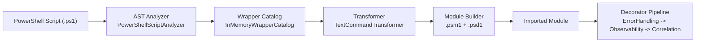
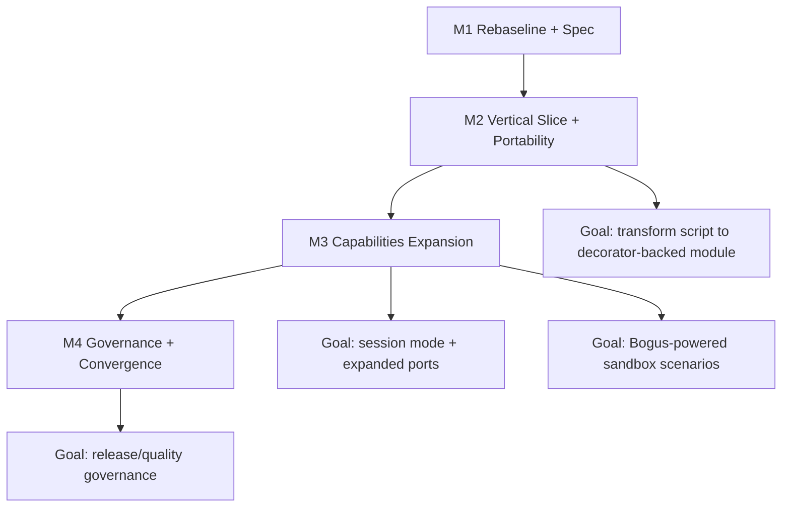

# alloyed-devops-multitool

[](https://github.com/Ligare-Method/alloyed-devops-multitool/actions/workflows/ci.yml)
[](https://github.com/Ligare-Method/alloyed-devops-multitool/actions/workflows/pull-request-checks.yml)

Multitool transforms PowerShell scripts into wrapper-based modules and routes supported operations through a decorator pipeline (ErrorHandling, Observability, Correlation).

## Why this project

- Keep existing PowerShell scripts, but make execution deterministic and governable.
- Add cross-cutting behavior without polluting business logic.
- Build a path from migration to production usage with reversible milestones.

## Current baseline (verified 2026-04-27)

- `pwsh -NoProfile -File ./dev.ps1 -Stage ci` passes locally.
- Unit tests: `46` passed.
- Integration tests: `13` passed.
- End-to-end smoke: passed.
- `Provider.FileSystem` ports include `Get/Copy/Move/Remove/New-Item` and `Get/Set-Content` wrappers.

## Quick start

### 1. Run local CI-equivalent

```powershell
pwsh -NoProfile -File ./dev.ps1 -Stage ci
```

### 2. Transform script into a module

```powershell
Import-Module ./src/powershell/Alloyed.DevOps.Multitool.psd1 -Force

New-AlloyedModuleTransform `
  -ScriptPath ./samples/sample-transform-input.ps1 `
  -ModuleName DemoAlloyed `
  -OutputPath ./temp/out `
  -Force
```

### 3. Validate only (without keeping output)

```powershell
Test-AlloyedTransform -ScriptPath ./samples/sample-transform-input.ps1
```

### 4. View available command mappings

```powershell
Get-AlloyedCatalog
```

### 5. Inspect resolved runtime configuration

```powershell
Get-AlloyedRuntimeConfiguration
```

### 6. Enable and disable session mode

```powershell
Enable-AlloyedSessionMode
Get-AlloyedSessionModeStatus

# when finished
Disable-AlloyedSessionMode
```

### 7. Enable and disable transparency watch mode

```powershell
Enable-AlloyedTransparencyMode
Get-AlloyedTransparencyModeStatus
Disable-AlloyedTransparencyMode
```

## How it works



## Roadmap alignment

The migration backlog is tracked as GitHub milestones:

- [M1: Rebaseline & Phase 1 Spec Closure](https://github.com/Ligare-Method/alloyed-devops-multitool/milestone/1)
- [M2: Phase 2-3 Hardening (Vertical Slice + Portability)](https://github.com/Ligare-Method/alloyed-devops-multitool/milestone/2)
- [M3: Phase 4 Capability Expansion](https://github.com/Ligare-Method/alloyed-devops-multitool/milestone/3)
- [M4: Phase 5 Convergence & Governance](https://github.com/Ligare-Method/alloyed-devops-multitool/milestone/4)



## Collaborator workflow

### Setup once

```powershell
pwsh -NoProfile -File ./dev.ps1 -Stage setup
```

This enables `.githooks/pre-push` (`build + format check + PowerShell lint + unit tests`).

### Fast loop

```powershell
pwsh -NoProfile -File ./dev.ps1
pwsh -NoProfile -File ./dev.ps1 -Stage integration
pwsh -NoProfile -File ./dev.ps1 -Stage full
```

### Targeted test run

```powershell
pwsh -NoProfile -File ./dev.ps1 -Stage unit -Filter "FullyQualifiedName~TransformationPipeline"
```

## CI/CD

- Main CI workflow: `.github/workflows/ci.yml`
- PR governance workflow: `.github/workflows/pull-request-checks.yml`
- Preview package publish workflow: `.github/workflows/publish-preview-module.yml`
- Optional Jenkins Podman remote template: `Jenkinsfile.podman-remote`
- Podman/Jenkins runbook: `docs/temporary-ci-podman-remote.md`
- Runtime config reference: `docs/runtime-configuration.md`

### Publish preview module to GitHub Packages

Use Actions -> `Publish Preview PowerShell Module` and fill:

- `module_version`: base version, for example `0.2.0`
- `prerelease_label`: usually `preview`
- `prerelease_iteration`: for example `1` (result version: `0.2.0-preview.1`)

The workflow stages module files with compiled host assemblies and publishes to:
`https://nuget.pkg.github.com/Ligare-Method/index.json`.

## Containers

Build:

```powershell
docker build -f Containerfile -t alloyed-devops-multitool:dev .
```

Run:

```powershell
docker run --rm alloyed-devops-multitool:dev
```

Compose:

```powershell
docker compose -f compose.yaml build
docker compose -f compose.yaml run --rm build
```

## Repository map

- `src/dotnet/Alloyed.DevOps.Multitool.Core.Ast` - AST analysis
- `src/dotnet/Alloyed.DevOps.Multitool.Core.Catalog` - command mapping catalog
- `src/dotnet/Alloyed.DevOps.Multitool.Core.Builders` - transformation and module build
- `src/dotnet/Alloyed.DevOps.Multitool.Core.Decoration` - decorator pipeline runtime
- `src/dotnet/Alloyed.DevOps.Multitool.Host.PowerShell` - orchestration host
- `src/powershell` - user-facing PowerShell module
- `tests/dotnet` - unit and integration tests
- `tests/powershell` - smoke flow
